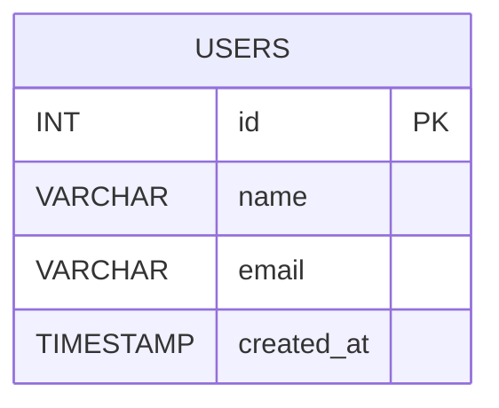

## 仕様
DDL（データ定義言語）文を用いて、Mermaid.jsで使用する図を生成する。

### 使用例

次のDDL文を入力する。
```sql
CREATE TABLE users (
  id INT PRIMARY KEY,
  name VARCHAR(100),
  email VARCHAR(100),
  created_at TIMESTAMP
);
```

次のMermaid.jsのコードが生成される。


## cargo

次のコマンドで新しいプロジェクトを作成することができる。

```bash
cargo new hello_cargo
```

次のコマンドでビルドすることができる。

```bash
cd hello_cargo
cargo build
```

次のコマンドで実行することができる。

```bash
cargo run
```
